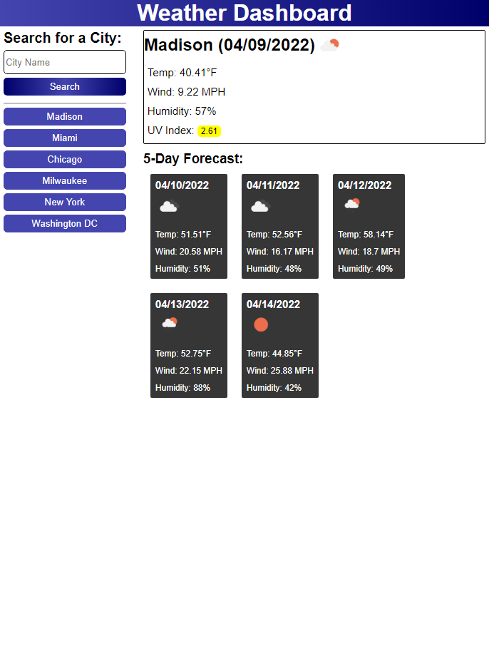

# Weather Dashboard

## Purpose
This website functions as a weather dashboard allowing users to search for a city and display the forecast for the city. A user's previous searches are stored in a list allowing the user to quickly re-search a city. 

This website also serves as a submission to an assignment that tests students' skills with HTML, CSS, and JavaScript while focusing on the use of server-side APIs and fetch requests. 

## Built With
* HTML
* CSS
* JavaScript
* Moment.js

## Website Link
https://mazattack1999.github.io/weather-dashboard/

## Contribution
* Created by Micah Zahn

## Server-side APIs
* Open Weather API: https://openweathermap.org/api/one-call-api

## Screenshot
